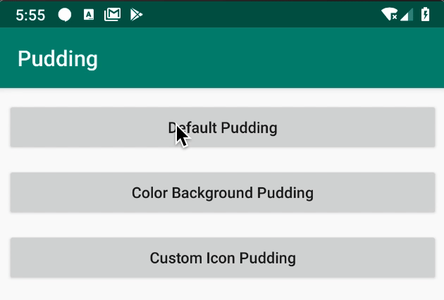
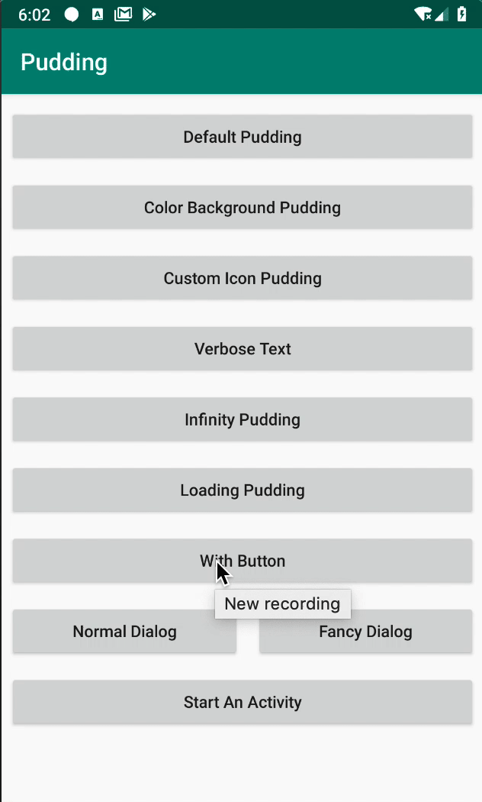

# Pudding
[](https://jitpack.io/#o0o0oo00/Pudding)

代替Toast/SnackBar新方式，使用WindowManager 无需申请权限

### WIKI

[中文说明](https://github.com/o0o0oo00/Pudding/blob/master/WIKIPAGE.md)

### Usage

```groovy
allprojects {
    repositories {
    ...
     maven { url 'https://jitpack.io' }
```

```groovy
implementation 'com.github.o0o0oo00.Pudding:pudding:v1.1.2'
```


GIF可能要等会就顺畅了，一开始可能会比较迟钝 (●ﾟωﾟ●)

常见的可配置的几种形式

Common configurable Pudding 



```kotlin
Pudding.create(this) {
    setTitle("This is Title")
    setText("this is text")
}.show()
```

```kotlin
Pudding.create(this) {
    setChocoBackgroundColor(resources.getColor(R.color.colorAccent))
    setTitleTypeface(Typeface.DEFAULT_BOLD)
}.show()
```

```kotlin
Pudding.create(this) {
    setTitle("Choco Title")
    setText("this is text")
    setIcon(R.drawable.ic_event_available_black_24dp)
}.show()
```

```kotlin
Pudding.create(this) {
    setTitle("Choco Title")
    setText("This is Text , it's very short and I don't like short \n This is Text , it's very short and I don't like short")
    onShow {
        Toast.makeText(this@MainActivity, "onShowListener", Toast.LENGTH_SHORT).show()
    }
    onDismiss {
        Toast.makeText(this@MainActivity, "onDismissListener", Toast.LENGTH_SHORT).show()
    }
}.show()
```


配合[FancyDialog](https://github.com/o0o0oo00/FancyDialog)可实现**Pudding**显示在**Dialog**的阴影之上

With [FancyDialog](https://github.com/o0o0oo00/FancyDialog), Pudding can be displayed above the shadow of Dialog.




每个Activity拥有各自的Pudding，互相之间不影响

Each Activity has its own Pudding, which does not affect each other.


**Imitate [Alerter](https://github.com/Tapadoo/Alerter) and ☆⌒(*＾-゜)v THX!! a lot** 

### what's different

Use activity decorView we can show a view on top of Activity。but when dialog is showing , its black background will cover the view , that is not cool. so i create this repository to solve this problem , and  I hope it's useful to you

### Something new

* Use DSL style to config `Choco`
* Show Queue
* Cover Dialog/PopWindow
* Don't need to request permission


#### TODO

1. 两种addView方式
    -   [x] activity decorView
    -   [x] windowManager 
        -   [x] 动画显示
        -   [x] 生命周期控制
        -   [x] 有权限/无权限情况 (考虑到这个需求不是很大，而且每个项目的权限适配都不一致，而且国产手机权限这一块参差不齐，所以决定不做这一块了，对功能也没影响)
        -   [x] 各个版本的适配

2. 内部显示队列(考虑可以使用kotlin通道来实现)
    -   [x] 上一条未消失时，后来一条等待
    -   [x] 直接顶掉上一条，上一条渐变消失

3. 左右/上下滑动消失动画

    - [x] 上下消失
    - [x] 左右滑动消失

4. Pudding cover dialog

    - [x] 配合[FancyDialog](https://github.com/o0o0oo00/FancyDialog)实现 


#### 可能会有的疑问：

- [x] **Pudding**使用的是WindowManager 难道不需要申请权限吗？

  - [x] **Pudding**使用`WindowManager.LayoutParams.TYPE_APPLICATION_SUB_PANEL`的层级低于系统级层级`TYPE_SYSTEM_ALERT`也就是在2000之下，是不需要申请权限的。

- [x] 不同的Activity对应的WindowManager是否相同

    - [x] 不同的window，不同的WindowManager，相同的WindowManagerGlobal（最终实现view的添加、删除、更新）

- [x] 不同的WindowManager为什么可以移除对方的View

    - [x] 因为所有的Activity共同只有一个WindowManagerGlobal（其内部持有所有添加的View的集合引用）

- [X] 如何去维护一个Pudding队列

    - [x] 用一个`Map<string,pudding>`
    - [X] 什么时间 去clear这个map (●ﾟωﾟ●)挠头？
            when activity destory clean the key which is activity toString()
